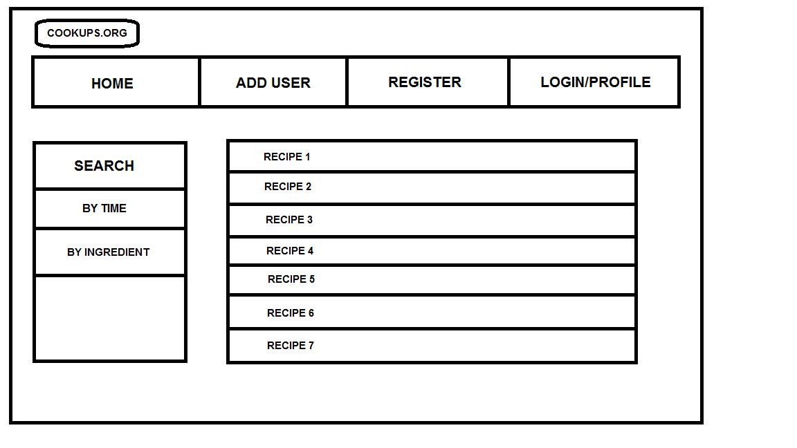
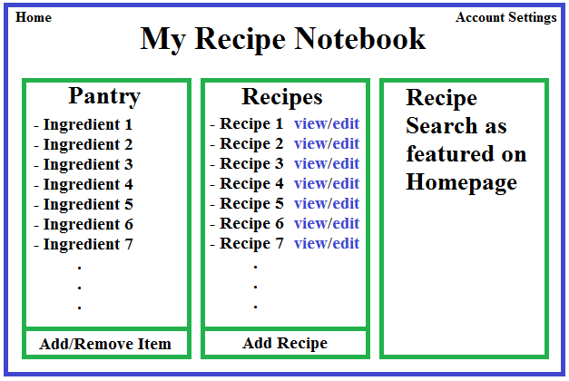
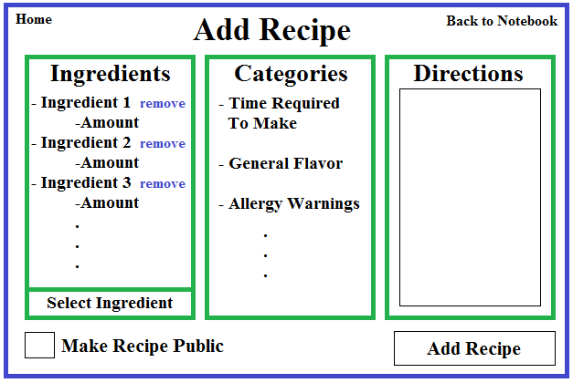
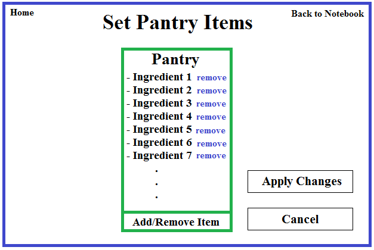

#CookUps#

### Functional/User Specification 

# Team Organization 
[Edited by Albert, Patrick 12/04/2014]

###Evan: Front-end developer

Evan is responsible for implement the UI design and functionality for the profile page.

###Gabriel: Server connection developer

Gabriel is responsible for allowing http requests and databases storage to be handled within his own personal server.

###Jon: Backend developer

Jon is responsible for creating the PostgreSQL scheme and database on Gabriel's server

###Albert: Front-end developer

Albert is responsible for implementing the UI design and functionality for the add recipe page

###Patrick: Front-end developer

Patrick is responsible for content and design of the html/css, as well as secretary tasks.

###Mina: Back-end developer

Mina is responsible for the search functionality and yummly coordination. As well as secretary tasks. 

###Isaac: Back-end developer

Isaac is responsible for routes and helping Jon on the database. 

# Overview 
[Edited by Patrick,Mina 12/02/2014]

Think of Cookups as the "Google for Recipes"! Cookups allows you to search for recipes based on your available ingredients. Cookups users can rate recipes, add comments on recipes and also recipes on social networking sites. In addition, Cookups also allows users to signup and register on our website. Once user register with Cookups, they become Cookup members and they can create their own recipe diaries, add their personal recipes to their recipe diary, keep track of food they have cooked in past and bookmark their favourite recipes. All you have in your house is cheese, milk, bread, and dog biscuits? Well check out our site to see what crazy concoctions you can make! Sadly, dog biscuits aren't in our database, but boy can you find some gourmet delectables with easy ingredients that can truly wow your friends. Ever seen the move Ratatouille? With this site on hand, you could destroy even that culinary genius of a mammal on any Iron Chef or Hell's kitchen. Move over Ramsey, user is here to demolish your taste buds, implore you curiosity, and lavish your essence in the finer luxuries demonstrated upon entrance to this easy to get to site. The best part is, you can brag about your delicious finding AND creations (yes, recipes are customizable, your own database of deliciousness, take that supercooks), by grabbing a membership today. Interested? Good. Hungry? Great. Thirsty? Amazing. Have dental issues? We can't really do much about that, you should go to the doctors or something. But we can fill your sickly mouth with the pleasure it deserves. 

[Edited by Patrick, 10/16/2014]
*DISCLAIMER : This document does not necessarily represent the final product accuratly as revisions will and can be made. Many parts of this document are a genralized version of the final product. Graphics and exact specifics are not completly discussed for all features, as this document mostly focuses on the skeleton of functionality only*

# Scenarios 
[Edited by Patrick, 12/02/2014]

*Jasper* is new in town and has been a cooking enthusiast for years. She has cookbooks lining the shelves of her house, but recently she's been getting a little bored with the new stuff. She has all these delicious ingredients she wants to make into something wonderful, but isn't sure how to mix them. Well look no farther, because as she opens our cite, she simply types the ingredients she wants to use and BOOM! An assortment of culinary masterpieces bestow her eyes and all she needs to do now is pick one...

*Frank* is home alone again and once again needs to whip up something delicious to put him back into the mood. Luckily, he has been a member of cook ups.org for a long time now, since he gets into this situation all the time! But all he has is bread butter and cheese and wants to know what he can make, and he's had the same exact ingredients many time before. So he looks into his favorites and o wow! He totally forgot he could make cheesy bread with mayo on top! Luckily the instructions are here for him to use again, great job Frank.

*Kerry* is in one of her moods again. "Nothing is cool enough for me", she always pouts. "I want something cool". She enters the world of the internet and stumbles upon our site. "Wow, how lame, I have too many ingredients I don't want to bother to type". Well no fear Kerry, as she realizes she can browse immediately when she gets on the scene. "But all I want to see is salty italian food". STILL FEARLESS, with our easy to use categorial tabs, you can search for foods based on whatever specifications you have, now Kerry is felling cooler than she's felt in years.

*Tim* is a UMA CompSci 326 teacher and wants to check out this new site some of his students were praising. So he goes to cookups.org and checks out whats going on. He sees a whole bunch of foods, tries them out, and loves them. His mind was totally blown by the food, but mostly the beauty of the site. He wants to leave comments for some of the foods he tried to let both other users and the people who made the recipe how good it was, so he clicks in the comment section and.... O no.... What is happening, the site must be broken he cannot comment. All seems lost, but then out of the corner of his eye, Tim sees something popped up in the comment section. "You must be a user to comment, register now!". What a brilliant site! It knew he would be confused if he could just not comment and asks him to sign up! So Tim registers and is now free to comment (and rate and save and other such things) foods as he pleases! A's all around!

*Kasandra* is a brilliant artist and loves making new things. Now just the other day she made the craziest food in the world and has been searching tirelessly for a place to share her concoction with the world. Which was so wonderful she found our site. She created and account, and has been uploading different recipes for the past 24 hours, and everyone has loved them!

*Mercedes* is Kasandra's younger sister and has the same passion for food making, and has also been tirelessly been uploading recipes. Sadly all her food creations taste like Bart's relationships with women, bad. Luckily, Cookups.org has a rating system in place! Users can rate foods and if they are really really bad they can get deleted from the sites database (well not really, Mercedes can keep looking at them).

*Dr. Victenstein* is the captain of his Rugby team, and his team just got BODIED by the Zimbabwe team, absolutely steam-rolled. Disheartened he went home to have a slice of cake. And after eating the entire cake, realized his eating habits were a little misplaced for a rugby captain. So he started using our site to help him with him and his teams eating habits, with our nice calorie counter, and wow the next year they won 1000 to 60. What a turnaround! But, now that he's a huge celebrity, people keep hacking his account and now he is sad. So, since we have such a feature, he deleted his account, and now people can't get in! Hooray! Of course then he created a new one using the easy register feature...

*Bartholomule* loves everything about the site. So he wants to know all about us and contact us. Great! He goes to the about us section and reads all about us, but a contact section is a non-goal so he can't even speak to us ever.

#Why Cookups?
[Edited by Evan Bellmore, 10/21/2014]
### What makes COOKUPS unique ###

* CookUps differs from the competition in that it is easy to browse recipes by multiple different fields not only ingredients. We give our users convenience, tasty food and fitness under one roof. You may browse recipes by preparation time, nutrition facts, preferred cuisine, course, dietary restrictions and food allergies. Unlike our competititor's websites, CookUps is not just a cooking website, but it also caters to your health and convenience.
* CookUps is self-contained website that offers you all under one roof. Unlike our competitors, e.g. Supercooks, we do not sprawl the web for recipes and redirect the user to other websites. Instead, we have our own database from Yummly and we never redirect the user to another website. We provide all the information our user needs on our website and since we look for recipes in our database, not the web, we avoid dublication of recipes. This means that if you get 5 search results, you have 5 different dishes and not just 5 variants of one dish.
* Once a recipe is found CookUps will make a shopping cart for you of needed ingredients. If you have everything great, if not our shopping list makes it easy to run to the store and pick up missing ingredients.
* Cookups makes cooking fun by adding a social component to cooking. You may add, share and recommend recipes on Cookups and talk about cooking on our forums. We make Cookups highly personalized for the user since our members can add your favorite recipes to CookUps' local database and you can access them from anywhere and/or share them with your friends.
* Cookups also keeps track of the food the members decide to cook in members personal accounts so that our members may keep track of your diet using Cookups.

# Website features
[Edited by Isaac Vawter and Mina Khan, Patrick 12/04/2014]

### Member's Recipe Notebook

Each registered user on cookups.org will have their own personal recipe notebook. The _My Recipe Notebook_ page is a virtual representation of the user's recipe book and will consist of three sections: pantry items, personal recipes, and recipe search. *DISCLAIMER : Not in Beta release.*

### Pantry Items

Pantry items are a list of items representing the ingredients that the user always has on hand. These items will automatically be included in any recipe searches made by the user. This will greatly improve the user's experience by saving them time when searching for recipes. The items will be listed on the screen under the title ìPantryî along with a button that allows the user to add or remove ingredients from the list. Clicking the ìAdd/Remove Itemsî button will navigate the user to the _Set Pantry Items_ page, which sole purpose is for editing a user's pantry items. 
*DISCLAIMER : Not in Beta release.*

### Personal Recipes

The second section of the page, personal recipes, will be a list of all the recipes added by the user and will be displayed under the title ìRecipes.î There will also be an ìAdd Recipeî button at the bottom of the list, which will navigate the user to the _Add Recipe_ page, allowing them to add a recipes to the list. Each recipe will be accompanied by a view and edit button. The view button will navigate the user to the standard recipe view page. The edit button will navigate the user to the _Add Recipe_ page with the fields initially set to correspond with the original recipe. This section allows the user to quickly find recipes they've added to the site and improve them whenever they desire. 

### Recipe Search
[Edited by Albert, 10/16/2014]

The recipe search area of the page will be similar to the recipe search featured on the homepage of cookups.org. This allows the user to search for recipes directly from their notebook, thus saving them from having to navigate back to the home page to make recipe searches.

### Search by recipe

When a user wants a specific recipe, cookups.org offers the option to search by recipe names. When searching by recipe, recipes names that contain the same words that were searched will appear. We will implement this by comparing the string that is searched with all the recipe names within the database and the recipe names that do contain the searched words will be the ones that will be shown to the user.

### Search by ingredients

The main baby of the whole site, the users input the ingredients that they have, and the recipies that have the included in the list they give. This is implemented by having an auto complete feature so they don't input ingredients that the database doesn't recognize. 

### Search by percentage of ingredients

Some users are limited by the amount of ingredients that they have and want to make something with those ingredients. Cookups.org offers the options to search for recipes by ingredients. Users can enter in the ingredients that they have and results that are shown are recipes that contain those ingredients. We will implement this by storing the ingredients of each recipe within our database and if the ingredients that are being searched are used within the recipe, the recipe will be shown to the user.
*DISCLAIMER : Not in Beta release*

### Search by calories/allowed diet

Some users are crazy about calories and will only consume foods that fit with their diet or within a specific calorie amount. Cookups.org offers the option to search for recipes based on the amount of calories. When users search for a recipe within a specific calorie range, the recipe results will be shown to the user based on the requested calorie range. We will implement this by having the total amount of calories for each recipe within our database. Also, this goes hand in hand with the allowed diet feature, if the food that you search fits into you diet specifications, it shows up, otherwise it won't, a great feature for those trying to get into a new health habit.

### Search by food origin

Some users have cravings for a specific type of food whether it is American, French, Mexican, or Japanese food, cookups.org offers the option to search by food origin. If you're craving for a specific type of food, one can simple click the options that are available and recipe results will be shown to the user. We will implement this by having a food origin selection for each recipe within our database.
*DISCLAIMER : Not in Beta release*

### Search by spice level/flavor/cuisine preference

Some users cannot handle very spicy foods while others can. Cookups.org offers the option to search for recipes based on spice levels. As users search for spice levels, recipe results will be shown to the user based on the requested spice level. we will implement this by having our own spice rating scale (0 - 5 where 0 is not spicy and 5 is super spicy) within our database. Same thing with flavor, and cuisine preference. They each can be set to filter your searchs so that you get only what you are craving. Cuisine preference is type of food, like Italian, American, Chinese, or whatever you want. 

### Search by preparation time

When users are restricted to time or they just want something super fast, simple, but yet delicious, cookups.org offers the option to search for recipes by preparation time. When users select one of the general preparation time options, recipe results will be shown to the user based on the requested preparation time. We will implement this by having an estimated preparation time for each recipe within our database.

### Search by allergies

Do you have an allergy to fish but still want to find a tasty meal? No problem, you have the option to search by allergy so you can avoid meals that would cause your body harm. 

### Search by holiday/season

If its a seasonal time, and you want a food to go along with the holidays, each recipe has an attribute associated with holiday or season. This way, users can get foods that roll with the seasons.

### Search by course

Want a snack? Filter your search. Want a side? Filter your search. Want a main course? Filter it. You can cater your search to what course you want.

### Add Recipe
[Edited by Isaac Vawter, 10/16/2014]

Registered users of cookups.org will be able to add recipes to our database using the _Add Recipe_ page. This improves the experience of all users of cookups.org by increasing the number of recipes available to them and allowing registered users to store their recipes on our website. This page is accessible from the user's _My Recipe Notebook_ page and is divided into three sections: Ingredients and Amounts, Categories, and Directions. At the bottom of the page there is an "add recipe" button as well as a "make this recipe public" box. The "make this recipe public" box allows the user to choose which of their recipes they share with other users of the website.

### Ingredients and Amounts

Within the "Ingredients and Amounts" section of the page, the user starts off by selecting ingredients from a drop-down list. Each added ingredient is displayed with a field for the user to enter the amount of that ingredient needed for the recipe. The ingredients also have a remove button so that the user can delete ingredients that were added by accident.

### Categories

The categories section of the page allows the user to classify their recipe according to different categories. These categories may include calorie count, preparation time, general flavor, degree of spiciness, food origin, etc. This is especially important with recipes the user flags as public, because it makes it easier for other users to find the recipe when browsing or searching by category.

### Directions

The directions section of the page is just a large field for the user to enter directions. This gives the user freedom to be as detailed or concise as they wish when explaining the preparation of the recipe. Any details and instructions that the user might not be able to specify in the other sections can be included in the directions section.

### Rating/Comments
[Edited by Patrick Collins, 12/04/2014]

The rating system is a way for users to help other users decide on what they want and like. Every recipe comes with a rating at the bottom and all the ratings in the system will be meaned together to get the average which will be displayed. This is a member only function. This goes hand in hand with the comments section, at the bottom of every recipe will also be the comments with their ratings. Also member only function. 
*Disclaimer: Not in Beta release.*

### Registration

People may sign up to our sight to get access to many member only functions like add recipe, comment, rate, save recipe, etc. Its simple and quick. This is so that when people come back and want to see stuff they had before it will still be there. Anywhere on the cite they can access the sign up page. 

# Non-Goals #
[Edited by Isaac Vawter, 10/16/2014]

The design of cookups.org is intended to fully satisfy our users while placing the minimum burden on our investors. To accomplish this we have established non-goals to eliminate unnecessary development costs. Our website will not be using cookies to store user information between visits. All user-specific information will be stored on the cookups.org server and will be accessible to the user after they log onto the site. Our website will not feature a sophisticated email-based password recovery system, but may incorporate a hints-based system instead. Cookups.org will not include social networking elements such as inter-user messaging, friending or following. We will not be verifying the accuracy of categorical information contained in the recipes displayed on cookups.org such as calorie count or allergy information. Our users will be informed of this when they use our site and will be encouraged to only use recipes that contain ingredients that are safe for their consumption.

# FlowChart #
[Edited by Patrick, Gabriel  12/04/2014]

# Screen-by-Screen Wireframes#
[Edited by Mina, Evan and Isaac 10/16/2014]
 
### Landing & Search page 

### Recipe List (Search Results)

### Browsing specific Recipe

### Login

### Register

### User Profile

### User's Notebook for Recipe

### User Interface to Personal Recipe to Recipe Diary

### Set Pantry Items for User

