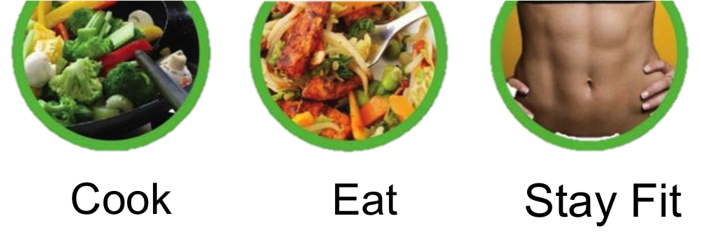
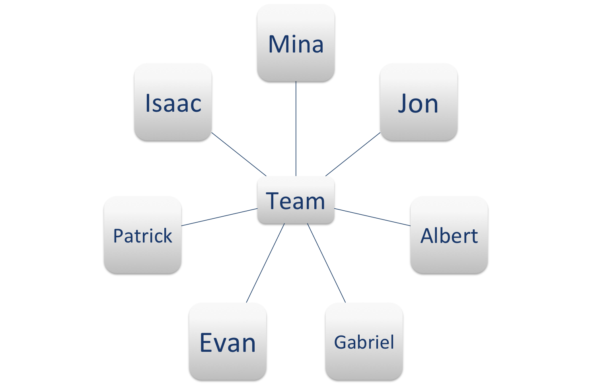
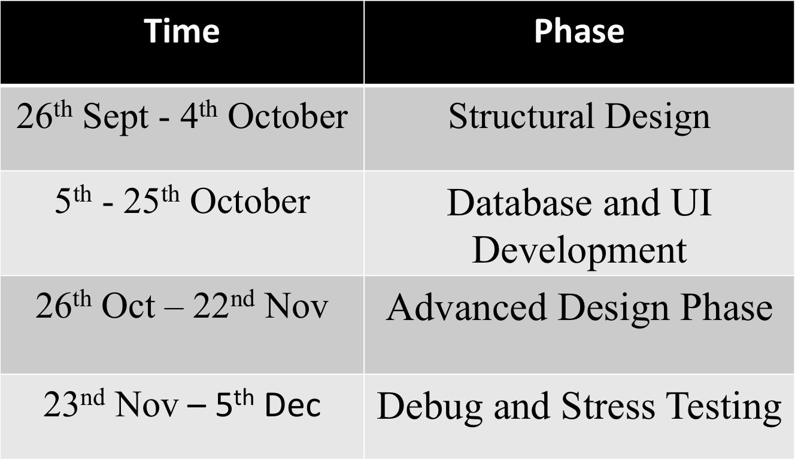

# Team Cinnamon Crickets Proposal #

#COOKUPS#
 Author: Mina, October 2nd / Evan Bellmore, October 21

### Why COOKUPS ###

* Tired of eating out?
* Bored with cooking the same food?
* Want to get creative with your ingredients?

### COOKUPS will spice up your life! ###

* CookUps generates recipes for your ingredients.
* CookUps gives you calorie counts for our food.
* CookUps stores your favorite home recipes.

### What makes COOKUPS unique ###

* CookUps differs from the competition in that it is easy to browse recipes by multiple different fields not only ingredients. We give our users convenience, tasty food and fitness under one roof. You may browse recipes by recipe name, food allergies, ingredient names, allowed diet, cuisine preference, food course, holiday and season, preparation time, flavors, calories, and nutrients. Unlike our competititor's websites, CookUps is not just a cooking website, but it also caters to your health and convenience.
* CookUps is self-contained website that offers you all under one roof. Unlike our competitors, e.g. Supercooks, we do not sprawl the web for recipes and redirect the user to other websites. Instead, we have our own database from Yummly and we never redirect the user to another website. We provide all the information our user needs on our website and since we look for recipes in our database, not the web, we avoid dublication of recipes. This means that if you get 5 search results, you have 5 different dishes and not just 5 variants of one dish. *DISCLAIMER : Not in Beta release*
* Once a recipe is found CookUps will make a shopping cart for you of needed ingredients. If you have everything great, if not our shopping list makes it easy to run to the store and pick up missing ingredients.
* Cookups makes cooking fun by adding a social component to cooking. You may add and share recipes on Cookups. We make Cookups highly personalized for the user since our members can add your favorite recipes to CookUps' local database and you can access them from anywhere and/or share them with your friends.
* Cookups also keeps track of the food the members decide to cook in members personal accounts so that our members may keep track of your diet using Cookups. *DISCLAIMER : Not in Beta release*
 

### Problem Statement
Food is a huge part of life, for obvious reasons, we need it to live. But sometimes, you may not have all the ingredients of a 5 star French resturant, but still want to make a nice meal. But not just that, you want to make a nice meal with what you have AND when you come up with that delicious meal, you want to share it with your friends. A website that helps the baking and cooking illiterate excel would be ideal.
Moreover, the problem is not just cooking tasty food conveniently, but also making sure that the food you eat is healthy and is in line with your dietary restrictions and nutritional needs.
Along with that, Instagram became incredibly popular for just taking photos of the food they eat, our site focuses around those foods to be shared when someones idea for a great recipes comes to life. Now people can try all the cool mixes you come up with for food, while we keep track of the health benifits of it for you with diet tracks. When you only have a few things to cook with, we can help you get the optimum outcome for that food. This will be a very multifunctional site that focuses on food, recipes, health, and sharing

#### Our Product

* Main
To make a food site that focuses around giving you a wonderful cook given the ingredients you have, or if you have a select amount of ingredients, making a great recipe to add and share, also a health aspect that helps you to choose healthy foods if you so please.

#### Related Courses

* CS 187: We need to be able to store many types of data in data structures such as usernames, passwords, recipies, categories, and being able to create and navigate these will be crucial.

* CS 220: Design Patterns will be needed and will be important due to that fact that with all our features, we need to be able to add or remove features that people want, a flexible code will be essential for this to happen.

* CS 345 Practice and Application of Data Management: CookUps will need a robust database as the backbone of the application and the team will use knowledge from 345 to create such a database. This will include efficient queries to search said database even with large amounts of data involved. This will be done using Postgresql which was taught in 345.

* Philosophy 360: Ethics are important because we want to figure out what in life is intrinsicly good, and what is not, this way we can decide how to best get the most intrinsically good site we can get!

* Economics: We performed a market analysis of consumer needs and realized that people wanted healthy and tasty food that they can conveniently cook under one roof. Thus, we are creating a website that gives consumers culinary excellence and health tracking at their convenience. We performed a SWOT (Stregth, Weakness, Opportunity and Threat) analysis of our different ideas and came to the conclusion that CookUps is the most strong idea for our product.

Also nutrition and food courses would be a bit needed, but as we are using an API that has most of that information, its almost not needed!

#Meet The Team!#
 Author: Isaac and Jon, October 2nd 

### Evan Bellmore###

Evan Bellmore originally from St. Peterburg, Florida but has lived in pittsfield, Massachusetts almost his entire life. Evan's family has always been big into technology and this has given him the drive to delve into the computer science field. Evan finds mobile development to be interesting and is experienced in Andriod development. Evan has interned for an insurance company for three years doing web development. Evan hopes to bring knowledge of the web and Andriod to his group.

### Patrick Collins###

Patrick loves smash brothers, fitness, dancing, and pretty much anything that is fun. Patrick likes it when his code compiles and does what he wants it to do, because he feels like the smartest person in the world when it does that. He is super hungry right now. Comics, cartoons, and anime are awesome. Bodybuilding.com is a super nice website for workouts, but Shaun T is the man. Everything amazing is Falco.

### [Mina Khan] (http://mina-khan.com)###

Mina Khan is a senior at Mount Holyoke College and is majoring in mathematics, physics, and computer science. Mina is from Pakistan and came to Massachusetts for college. Mina has done a lot of research on magnetic memory devices and robotics, and is currently working with Google Glass.

### Gabriel K. Lu###

Gabriel Kaili Lu is originally from Shanghai, China. Gabriel came to the United States three years ago and attended Bunker Hill Community College in Boston. Gabriel later transferred to the University of Massachusetts Amherst and continued his junior year studying computer science. Gabriel used to be a project manager for an ITE group in Shanghai and did sales work. Gabriel is a man born with charisma and creativity.

### Jon Saj###

Raised in Holyoke, Jon Saj is a student at the University of Massachusetts Amherst studying computer science. Interested in web and software development, he is expanding his exposure to different platformsto work on larger, scalable projects. In his free time, Jon can be found wakeboarding, snowboarding, restoring his jeep, wheeling his restored jeep, jamming with friends, on the guitar, or playing bass with the Elmwood Grove band. Also, his golden retriever is cooler than your cat.

### Albert Ung###

Albert Ung is a senior at the University of Massachusetts Amherst majoring in computer science with a minor in Chineses and information technology. Albert is from Saugus, MA. Albert is interested in web and software development, as well as backend databases. Albert loves to breakdance, play video games, and learn new things.

### Isaac Vawter###

Isaac Vawter is a 26-year old transfer student majoring in computer science at the University of Massachusetts Amherst. He grew up in Marysville, WA and later studied Chemical Engineering at Lehigh University. Isaac spent the last five years serving in the United States Marine Corps and is currently living with his wife, Laura, in South Hadley, MA.

# Our Implementation Plan #
 Author: Patrick, October 2nd 

### FrameWork ###
 - Node.js
 - Express
 - Bootstrap
 - PostgreSQL
 - Firefox/Chrome supported Browsers, maybe more
 - JavaScript
 - Yummly API

### Front End ###

**Design:** Developing the UI layout, design will ensure that the application’s looks and workflow are as smooth as can be. *(Patrick, Evan, Albert)*

**Functionality and Connectivity:** Working within the UI, the front end functionality and connectivity will create requests and handle responses sent from the back end. *(Evan, Patrick, Albert)*

### Back End ###

**Server Functionality and Connectivity:** Requests from the front end are handled, using the server’s resources to return a response. *(Gabriel)*

**Database Design and Connectivity:** Working within the server’s functionality, DB connectivity will handle the queries made to both the local database, where user information and custom recipes reside, and the external ‘Yummly’ database, where we access an existing library of recipes. *(Jon, Mina, Isaac)*

# Team Organization  #
 Author: Mina, Oct 22st, 2014 

###Evan: Front-end developer

Evan is responsible for implement the UI design and functionality for the profile page.

###Gabriel: Server connection developer

Gabriel is responsible for allowing http requests and databases storage to be handled within his own personal server.

###Jon: Backend developer

Jon is responsible for creating the PostgreSQL scheme and database on Gabriel's server

###Albert: Front-end developer

Albert is responsible for implementing the UI design and functionality for the add recipe page

###Patrick: Front-end developer

Patrick is responsible for content and design of the html/css, as well as secretary tasks.

###Mina: Back-end developer

Mina is responsible for the search functionality and yummly coordination. As well as secretary tasks. 

###Isaac: Back-end developer

Isaac is responsible for routes and helping Jon on the database.

# Cost Overview #
 Author: Gabriel, Oct 21st, 2014 

## Expenses 
|      Item         |       Cost       |                            Description                                |
|-------------------|------------------|-----------------------------------------------------------------------|
|                                              First Year Budget                                               |
|-------------------|------------------|-----------------------------------------------------------------------|
|    Office Rent    |    $ 60,000/FY   |                    For the first two years only                       |
| Office Utilities  |    $ 10,000/FY   | This includes electric, water, heat, Paper, Coffee, and Stationerys   |
|    Furniture      |    $ 5,000       |        This cost is for the first year only, shop from IKEA           |
|  First Year Wage  |    $ 462,000     |         7 employees, 5500 each / month. 5500x7x12 = 462,000.          |
|  Server + Domain  |    $ 6,000/FY    |          This is for the first year only. Own a server in 2nd year    |
|  External API     |    $ 2,800/FY    |  YummlyAPI: Growing factor. $100/mo first 4 mo. $300/mo next 8 mo     |
|  Company Register |    $ 1,000       | This includes fee to the gov and lawyer,only exists in the first year |
|    Marketing      |    $ 10,000/FY   | This is for propaganda purposes: Google's AdWords, Facebook Ads, etc. |
|  Office Hardwares |    $ 40,000/FY   | This is for hardware purchase and updates like Desktops, 3 in 1s      |
| Office Softwares  |    $ 5,000/FY   | This is for the software licences that desktops and laptops would use |
|  Other Use/Backup |    $ 12,000/FY   |         This is for backup use. Around 1K each mouth                  |
|-------------------|------------------|-----------------------------------------------------------------------|
|   1st FY Budget   |    $ 6,183,000   |   This is the expected expence that would occur during the first FY.  |
|-------------------|------------------|-----------------------------------------------------------------------|
|                                            Second Year Budget                                                |
|-------------------|------------------|-----------------------------------------------------------------------|
|    Office Rent    |    $ 60,000/FY   |                    For the first two years only                       |
| Office Utilities  |    $ 12,000/FY   | This includes electric, water, heat, Paper, Coffee, and Stationerys   |
|    Furniture      |    $ 1,000       |        This cost is for the second year only, shop from IKEA          |
| Second Year Wage  |    $ 672,000     |     10 employees, 5600 each / month. 5600x10x12 = 672,000             |
|  External API     |    $ 17,200/FY   |  YummlyAPI: Growing factor. $300/mo first 4 mo. $2,000/mo next 8 mo   |
|  Server + Domain  |    $ 12,000/FY   |                Server upgrade duing the second year                   |
|     Marketing     |    $ 15,000/FY   | This is for propaganda purposes: Google's AdWords, Facebook Ads, etc. |
|  Office Hardwares |    $ 10,000/FY   | This is for hardware purchase and updates like Desktops, 3 in 1s      |
| Office Softwares  |    $ 5,000/FY    | This is for the software licences that desktops and laptops would use |
|  Other Use/Backup |    $ 24,000/FY   | This is for backup use. Around 2K each mouth                         |
|-------------------|------------------|-----------------------------------------------------------------------|
|   2nd FY Budget   |    $ 8,280,200   |   This is the expected expence that would occur during the second FY. | 

### Employee Work Resources ###
- Custom made computers (speakers, keyboard, monitors, mouse included)
- Headphones
- Phones
- Laptops

# Timeline #
 Author: Isaac October 2nd 

The creation of cookups.org will be completed over a 9-week timeframe that is divided into four phases. At the end of each phase, cookups.org will be a fully functioning web application with the updated implementations, bringing improved functionality, performance, and aesthetics.

### Structural Design Phase: 9/26/2014 - 10/4/2014 ###
- Investigate deficiencies of similar websites
- Determine all applicable use cases
- Coordinate database functionality with use cases
- Acquire URL rights and set up pre-release web page

### Basic Database and UI Development Phase: 10/5/2014 - 10/25/2014 ###
- Research external recipe database APIs 
- Develop search by ingredients functionality
- Deploy Database Schema
- Create User Account functionality
- Develop add recipe functionality
- Link local and external database access
- Research server templates and commonly used css files
- Establish rudimentary menu trees and UI screens
 
### Advanced Functionality and Aesthetics Phase: 10/26/2014 - 11/22/2014 ###
- Research efficient and effective search mechanisms
- Add advanced search (time requirements, food category, primary flavor)
- Implement search result sorting
- Establish recipe rating system
- Allow recipe modification for user-created recipes
- Research elements that make a UI attractive and inviting
- Finalize appearance and functionality of the UI
 
### Debug and Stress Testing Phase: 11/23/2014 - 12/5/2014 ###
- Evaluate performance characteristics
- Confirm functionality in all use cases
- Stress test database and server functions
- Make all preparations for web application launch
